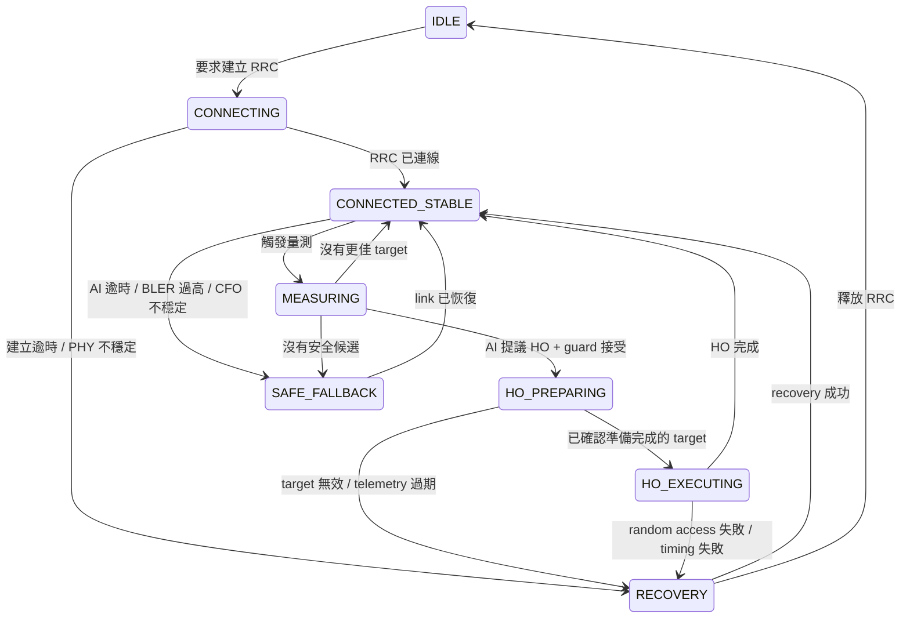

# 6G LEO / NTN 的 Neuro-Symbolic RRM 與 Handover Supervisor

## 狀態與範圍（Status and Scope）

- Lifecycle：`RESEARCH_PARKING / CONCEPT_PROTOTYPE`（研究停放／概念原型）
- Implementation status：`NOT_INTEGRATED`（尚未整合）
- Project boundary：不屬於目前 Lab01 / Lab02 validated mainline
- Runtime boundary：尚未實作或驗證真實 LEO / NTN integration

目前可成立的 claim 僅限於：已定義一套 Neuro-Symbolic RRM / Handover Supervisor 的
research prototype architecture。此架構包含 AI proposal、symbolic guard、
dynamic trust arbitration、deterministic fallback 與 PHY-aware constraints，
可作為未來 6G NTN / LEO handover 研究的候選起點。

本文件保存此架構，但不授權 source changes、scheduler changes、protocol control、
deployment、lab-host access 或 Runtime operation。

## 問題陳述（Problem Statement）

NTN 中的 LEO handover 不能只根據 SINR 選擇。某個 target 可能看似訊號良好，卻只剩
很短的可見窗口、超出 Doppler 或 residual CFO compensation capability、具有過高的
one-way delay，或只存在於 stale telemetry 中。HARQ BLER 與不穩定的 PHY 條件也可能
使高 confidence 的 proposal 變得不安全。

AI Agent 不得繞過 MAC / RRC 或 protocol causality。其輸出只能是 proposal，且仍受
symbolic constraints、dynamic trust threshold、deterministic fallback 與實際
physical link state 約束。

## 第一原理約束（First-Principles Constraints）

- **AI can suggest.（AI 可以提出建議。）**
- **State machine can veto.（State machine 可以否決。）**
- **Arbitrator decides trust.（Arbitrator 決定信任門檻。）**
- **PHY reality has final authority.（實際物理狀態擁有最終權威。）**
- **confidence cannot override physics.（confidence 不得凌駕物理限制。）**

因此，confidence 是必要條件，但永遠不是充分條件。只有在 telemetry 仍有效、action
符合目前 protocol state、target 可被觀測，且所有已設定的 PHY-aware guard conditions
均通過時，proposal 才具備被接受的資格。

## 系統 Pipeline（System Pipeline）

Canonical pipeline 如下：

```text
PHY/MAC Telemetry
  -> Observation Builder
  -> AI Agent
  -> AIProposal
  -> SymbolicGuard
  -> DynamicArbitrator lambda(t)
  -> RRMAction
  -> Protocol Adapter
  -> MAC / RRC / Scheduler / Mobility Execution
```

最後的 execution stage 是架構邊界，不代表已完成 integration。本文件中的任何元件都不會
呼叫真實 MAC、RRC、scheduler 或 mobility interface。

## 三層 Neuro-Symbolic Architecture

| 層級 | 角色 | 強制邊界 |
| --- | --- | --- |
| `AIProposal` | 提出候選 action，並表達 confidence 與 uncertainty。 | 僅能提出 proposal；不得直接呼叫 MAC / RRC。 |
| `SymbolicGuard` | 套用 RRC causality、handover phase causality、telemetry freshness、target validity 與 PHY-aware rules。 | 任一 violation 都會否決 proposal。 |
| `DynamicArbitrator` | 計算 `lambda(t)`，並判斷通過 guard 的 proposal 是否具備足夠 trust。 | 被拒絕的 proposal 會轉入 deterministic fallback。 |

被接受的結果會成為候選 `RRMAction`；未來的 `Protocol Adapter` 仍必須維持 state machine
與 implementation-specific safety checks。

## AIProposal

`AIProposal` 是只能提出 proposal 的資料結構。候選職責如下：

- 提議 handover；
- 提議 target satellite、beam 或 cell；
- 提議 RB allocation；
- 提議 MCS；
- 提議 safe fallback；
- 提議 redundant transmission。

它不得直接呼叫 MAC / RRC。代表性 fields 如下：

| Field | 概念意義 |
| --- | --- |
| `action` | 提議的 RRM 或 mobility action。 |
| `target_link_id` | 候選 satellite、beam 或 cell identifier。 |
| `rb_fraction` | 提議的 resource-block allocation fraction。 |
| `mcs` | 提議的 modulation and coding selection。 |
| `confidence` | 只能在 symbolic checks 之後使用的 model confidence。 |
| `uncertainty` | 提供給 arbitration 的 proposal uncertainty。 |
| `expected_reward` | Model 預估結果，不是 measured evidence。 |
| `policy_version` | 候選 proposal policy 的 identifier。 |

## SymbolicGuard

`SymbolicGuard` 會在 trust arbitration 前評估強制約束，職責如下：

- 強制執行 RRC causality 與 handover phase causality；
- 拒絕 stale telemetry；
- 確認 target 存在於目前 measurement set；
- 依 compensation capability 驗證 residual CFO 與 Doppler；
- 驗證 one-way delay 與預期 dwell time；
- 驗證 SINR / RSRP 與 link load；
- 納入 HARQ BLER 與其他 PHY 不穩定指標；
- 當 PHY 不穩定時拒絕 aggressive action。

較高的 AI confidence 無法抵銷 symbolic violation。

## DynamicArbitrator 與 lambda(t)

`DynamicArbitrator` 會計算 `lambda(t)`，也就是 dynamic AI trust threshold。
下列情況會提高 threshold：

- Doppler risk 上升；
- residual CFO 上升；
- one-way delay 上升；
- HARQ BLER 上升；
- AI uncertainty 上升；
- symbolic violation count 上升。

作為未來的 policy candidate，當 AI proposals 反覆被接受，且被接受的 proposals 產生
穩定結果時，threshold 可以下降。這是 design hypothesis，不是已驗證的 adaptation result。

Decision rule 必須嚴格執行：只有在沒有 symbolic violations，且 AI confidence 大於或等於
`lambda(t)` 時，才能接受 AI proposal；否則必須選擇 deterministic baseline fallback。

### 概念性 Arbitration Pseudocode

以下內容僅為 pseudocode，不是可執行的 Runtime integration，也不會呼叫真實 protocol
或 scheduler interfaces。

```text
record AIProposal:
    action
    target_link_id
    rb_fraction
    mcs
    confidence
    uncertainty
    expected_reward
    policy_version

record ArbitrationDecision:
    accepted_ai_proposal
    selected_action
    reason
    trust_threshold

function arbitrate(observation, proposal, history):
    violations = SymbolicGuard.evaluate(observation, proposal)
    trust_threshold = DynamicArbitrator.lambda(t, observation, proposal, history)

    if violations.is_empty() and proposal.confidence >= trust_threshold:
        return ArbitrationDecision(
            accepted_ai_proposal = true,
            selected_action = proposal.action,
            reason = "AI_PROPOSAL_ACCEPTED",
            trust_threshold = trust_threshold
        )

    fallback = deterministic_baseline_fallback(observation)

    if not protocol_state_allows(observation.ue_state, fallback):
        fallback = NOOP

    return ArbitrationDecision(
        accepted_ai_proposal = false,
        selected_action = fallback,
        reason = violations or "AI_CONFIDENCE_BELOW_LAMBDA",
        trust_threshold = trust_threshold
    )
```

## Protocol Causality 與 State Machine

RRC causality 與 handover phase causality 都是強制邊界。代表性規則如下：

- `IDLE` 不能執行 `ALLOCATE_RB`；user-plane RB allocation 需要
  `RRC_CONNECTED` semantics。
- `HO_EXECUTE` 不能跳過 `HO_PREPARE`。
- 不得選擇 measurement set 中不存在的 target。
- stale telemetry 不得驅動 handover。

候選 state model 如下：



## PHY-Aware Guard Conditions

本文件不主張任何數值 threshold。未來實驗必須先依已聲明的 model 或 measured capability
定義 threshold，才能進行評估。

| Observation | Guard 問題 | 候選安全回應 |
| --- | --- | --- |
| Telemetry age | Observation 是否足夠新，能支援 action horizon？ | 拒絕 stale input。 |
| Target membership | `target_link_id` 是否存在於目前 measurement set？ | 拒絕未知 target。 |
| Doppler | Target Doppler 是否在已聲明的 compensation capability 內？ | 拒絕或使用 safe fallback。 |
| Residual CFO | residual CFO 是否穩定且在已聲明的 limit 內？ | 提高 `lambda(t)` 或拒絕。 |
| One-way delay | Protocol timing 是否能容許 measured 或 modeled delay？ | 拒絕違反 timing constraints 的 actions。 |
| Dwell time | 有效可見時間是否長於 preparation 與 execution cost？ | 拒絕短暫 target。 |
| SINR / RSRP | 通過其他 constraints 後，link quality 是否足夠？ | 只視為一項 input，絕不作為唯一 authority。 |
| Link load | Target 是否能接受提議的 allocation？ | 降低 allocation 或拒絕。 |
| HARQ BLER | Reliability 是否足夠穩定，能支援提議的 action？ | 提高 `lambda(t)` 或選擇 fallback。 |

## Edge Cases

### `HO_PREPARING` 期間 AI failure

- 記錄 `AI_TIMEOUT`。
- 選擇 deterministic baseline fallback。
- 若 UE state 無法合法支援 user-plane action，則選擇 `NOOP`。

### 高 SINR 但可見時間很短

若 target 的 SINR 很高，但 dwell time 約為 `0.5 s`，則拒絕 handover，並記錄
`TARGET_DWELL_TIME_TOO_SHORT`。

### `IDLE` 狀態下分配 RB

拒絕此 proposal；不得在 `RRC_CONNECTED` 以外分配 user-plane RB。

### Confidence 與 Doppler

即使 AI confidence 很高，只要 target Doppler 超出 compensation capability，仍必須拒絕
proposal，並記錄 `TARGET_DOPPLER_EXCEEDS_COMPENSATION_RANGE`。

## 實作 Roadmap（Implementation Roadmap）

此 roadmap 定義 research gates，不是已排程的 implementation。每個 Phase 都需要另行建立
範圍明確的 task、evidence plan 與 Human Review decision。

## Phase A — Pure Simulator（純模擬器）

候選 elements：

- 簡化的 LEO orbit 或 satellite-pass trace；
- UE trajectory；
- RSRP / SINR generator；
- Doppler generator；
- delay generator；
- `AIProposal` generator；
- `SymbolicGuard`；
- `DynamicArbitrator`；
- handover result logger。

候選 metrics：

- `handover_success_rate`；
- `ping_pong_count`；
- `outage_time_ms`；
- `AI_accept_ratio`；
- `guard_reject_reason_distribution`；
- `lambda(t) time series`。

## Phase B — 5G SDR Observability Integration（可觀測性整合）

候選 observation sources；存取與 evidence 必須另行 Review：

- srsRAN / srsLTE logs；
- pcap 與 Wireshark observations；
- PHY metrics；
- MAC metrics；
- RRC events；
- ZeroMQ latency / packet timing。

候選 mapping targets：

- `PhyObservation`；
- `LinkCandidate`；
- `UEContext`。

此 Phase 只進行 observation mapping，不代表 control integration。

## Phase C — RRM / Handover Adapters

候選 adapter boundaries：

- `PhyTelemetryAdapter`；
- `MeasurementReportAdapter`；
- `MACSchedulerAdapter`；
- `RRCMobilityAdapter`。

上述名稱只描述可能的 interfaces，不代表 adapter、scheduler hook 或
mobility-control path 已存在。

## 與目前 5G SDR 專案的關係（Relation to Current 5G SDR Project）

目前 5G SDR 專案可提供關於 telemetry freshness、ZeroMQ timing、PHY 與 MAC
measurements、RRC events 與 evidence quality 的未來研究問題。本文件不宣稱目前
Lab01 / Lab02 artifacts 已填入 `PhyObservation`、`LinkCandidate` 或 `UEContext`，
也不修改或驗證任何目前 Runtime path。

## 目前限制與禁止宣稱（Current Limitations and Forbidden Claims）

不得以此架構作為下列事項的 evidence：

- 已符合 3GPP NTN compliance；
- 已實作真實 LEO handover；
- 已存在 srsRAN scheduler integration；
- 已實作 MAC / RRC mobility control；
- 已驗證真實 Doppler compensation。

此架構也不是與其他 RAN control architecture 之間已被接受的 bridge。任何此類 bridge
都需要另行進行 research intake 與決策。

## 未來問題（Future Questions）

- 需要何種 simulator fidelity，才能評估 dwell-time 與 Doppler guards，且不誇大
  real-world validity？
- Telemetry age 與 one-way delay 應如何影響 `lambda(t)`？
- 哪一種 deterministic baseline 能為 Phase A 提供公平比較？
- 在允許 `lambda(t)` 下降前，應如何定義穩定的 accepted outcomes？
- 從 observation mapping 進入 adapter design 前，需要哪些 evidence？
