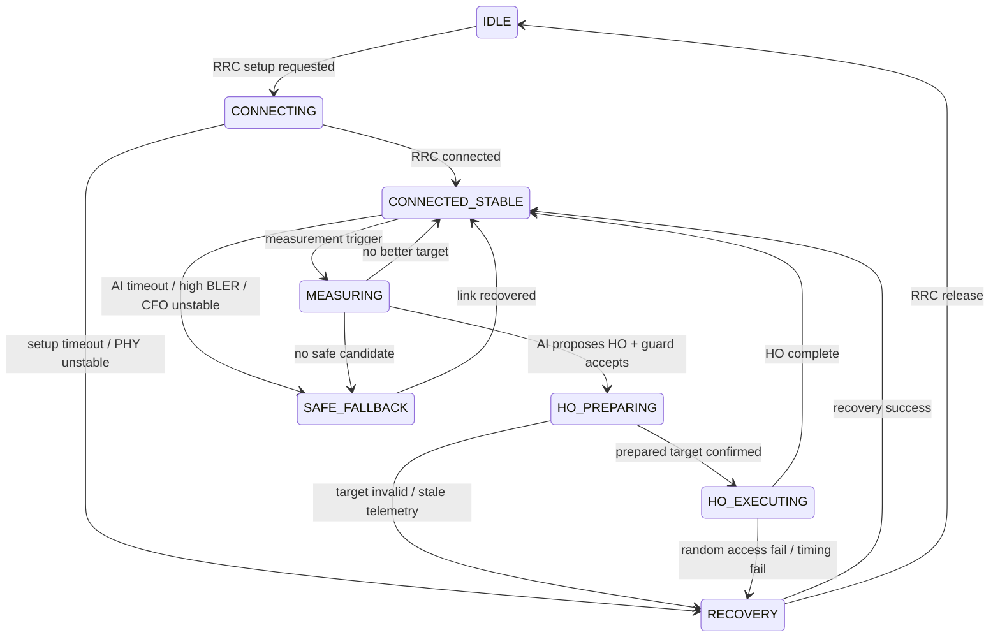

# Neuro-Symbolic RRM and Handover Supervisor for 6G LEO / NTN

## Status and Scope

- Lifecycle: `RESEARCH_PARKING / CONCEPT_PROTOTYPE`
- Implementation status: `NOT_INTEGRATED`
- Project boundary: not part of the current Lab01 / Lab02 validated mainline
- Runtime boundary: no real LEO / NTN integration has been implemented or
  validated

The current valid claim is limited to the following: a research prototype
architecture for a neuro-symbolic RRM / handover supervisor has been defined.
It includes AI proposal, symbolic guard, dynamic trust arbitration,
deterministic fallback, and PHY-aware constraints. It is a candidate starting
point for future 6G NTN / LEO handover research.

This note preserves the architecture. It does not authorize source changes,
scheduler changes, protocol control, deployment, lab-host access, or Runtime
operation.

## Problem Statement

LEO handover in an NTN cannot be selected from SINR alone. A target can appear
strong while offering too little remaining visibility, exceeding Doppler or
residual CFO compensation capability, carrying excessive one-way delay, or
being represented by stale telemetry. HARQ BLER and unstable PHY conditions can
also make a high-confidence proposal unsafe.

An AI Agent must not bypass MAC / RRC or protocol causality. Its output is a
proposal that remains subject to symbolic constraints, a dynamic trust
threshold, deterministic fallback, and the physical link state.

## First-Principles Constraints

- **AI can suggest.**
- **State machine can veto.**
- **Arbitrator decides trust.**
- **PHY reality has final authority.**
- **confidence cannot override physics.**

Consequently, confidence is necessary but never sufficient. A proposal is
eligible only when telemetry is fresh, the action is legal in the current
protocol state, the target is observable, and all configured PHY-aware guard
conditions pass.

## System Pipeline

The canonical pipeline is:

```text
PHY/MAC Telemetry
  -> Observation Builder
  -> AI Agent
  -> AIProposal
  -> SymbolicGuard
  -> DynamicArbitrator lambda(t)
  -> RRMAction
  -> Protocol Adapter
  -> MAC / RRC / Scheduler / Mobility Execution
```

The final execution stage is an architectural boundary, not an implemented
integration. No component in this note invokes a real MAC, RRC, scheduler, or
mobility interface.

## Three-Layer Neuro-Symbolic Architecture

| Layer | Role | Hard boundary |
| --- | --- | --- |
| `AIProposal` | Suggest a candidate action and express confidence and uncertainty. | Proposal only; cannot directly invoke MAC / RRC. |
| `SymbolicGuard` | Apply RRC causality, handover-phase causality, telemetry freshness, target validity, and PHY-aware rules. | Any violation vetoes the proposed action. |
| `DynamicArbitrator` | Compute `lambda(t)` and decide whether the guarded proposal has enough trust. | A rejected proposal routes to deterministic fallback. |

An accepted result becomes a candidate `RRMAction`; a future `Protocol Adapter`
would still have to preserve the state machine and implementation-specific
safety checks.

## AIProposal

`AIProposal` is a proposal-only data structure. Candidate responsibilities are:

- propose handover;
- propose a target satellite, beam, or cell;
- propose RB allocation;
- propose MCS;
- propose safe fallback; and
- propose redundant transmission.

It must not directly invoke MAC / RRC. Representative fields are:

| Field | Conceptual meaning |
| --- | --- |
| `action` | Proposed RRM or mobility action. |
| `target_link_id` | Candidate satellite, beam, or cell identifier. |
| `rb_fraction` | Proposed resource-block allocation fraction. |
| `mcs` | Proposed modulation and coding selection. |
| `confidence` | Model confidence used only after symbolic checks. |
| `uncertainty` | Proposal uncertainty supplied to arbitration. |
| `expected_reward` | Model-estimated outcome, not measured evidence. |
| `policy_version` | Identifier for the candidate proposal policy. |

## SymbolicGuard

`SymbolicGuard` evaluates hard constraints before trust arbitration. It is
responsible for:

- enforcing RRC causality and handover-phase causality;
- rejecting stale telemetry;
- verifying that the target exists in the current measurement set;
- validating residual CFO and Doppler against compensation capability;
- validating one-way delay and expected dwell time;
- validating SINR / RSRP and link load;
- considering HARQ BLER and other PHY-instability indicators; and
- rejecting aggressive action when the PHY is unstable.

A symbolic violation cannot be cancelled by higher AI confidence.

## DynamicArbitrator and lambda(t)

`DynamicArbitrator` computes `lambda(t)`, a dynamic AI trust threshold. The
threshold rises when:

- Doppler risk rises;
- residual CFO rises;
- one-way delay rises;
- HARQ BLER rises;
- AI uncertainty rises; or
- the symbolic violation count rises.

As a future policy candidate, the threshold may fall when AI proposals are
repeatedly accepted and those accepted proposals produce stable outcomes. This
is a design hypothesis, not a validated adaptation result.

The decision rule is strict: accept an AI proposal only when symbolic
violations are absent and AI confidence is greater than or equal to
`lambda(t)`. Otherwise, select a deterministic baseline fallback.

### Conceptual Arbitration Pseudocode

The following is pseudocode only. It is not executable Runtime integration and
does not call real protocol or scheduler interfaces.

```text
record AIProposal:
    action
    target_link_id
    rb_fraction
    mcs
    confidence
    uncertainty
    expected_reward
    policy_version

record ArbitrationDecision:
    accepted_ai_proposal
    selected_action
    reason
    trust_threshold

function arbitrate(observation, proposal, history):
    violations = SymbolicGuard.evaluate(observation, proposal)
    trust_threshold = DynamicArbitrator.lambda(t, observation, proposal, history)

    if violations.is_empty() and proposal.confidence >= trust_threshold:
        return ArbitrationDecision(
            accepted_ai_proposal = true,
            selected_action = proposal.action,
            reason = "AI_PROPOSAL_ACCEPTED",
            trust_threshold = trust_threshold
        )

    fallback = deterministic_baseline_fallback(observation)

    if not protocol_state_allows(observation.ue_state, fallback):
        fallback = NOOP

    return ArbitrationDecision(
        accepted_ai_proposal = false,
        selected_action = fallback,
        reason = violations or "AI_CONFIDENCE_BELOW_LAMBDA",
        trust_threshold = trust_threshold
    )
```

## Protocol Causality and State Machine

RRC causality and handover-phase causality are hard boundaries. Representative
rules include:

- `IDLE` cannot `ALLOCATE_RB`; user-plane RB allocation requires
  `RRC_CONNECTED` semantics.
- `HO_EXECUTE` cannot skip `HO_PREPARE`.
- A target absent from the measurement set cannot be selected.
- Stale telemetry cannot drive handover.

The candidate state model is:



## PHY-Aware Guard Conditions

No numeric thresholds are asserted here. A future experiment must define them
against a declared model or measured capability before evaluation.

| Observation | Guard question | Candidate safe response |
| --- | --- | --- |
| Telemetry age | Is the observation fresh enough for the action horizon? | Reject stale input. |
| Target membership | Is `target_link_id` in the current measurement set? | Reject an unknown target. |
| Doppler | Is target Doppler within declared compensation capability? | Reject or use safe fallback. |
| Residual CFO | Is residual CFO stable and within a declared limit? | Raise `lambda(t)` or reject. |
| One-way delay | Can protocol timing tolerate the measured or modeled delay? | Reject actions that violate timing constraints. |
| Dwell time | Will useful visibility outlast preparation and execution cost? | Reject a short-lived target. |
| SINR / RSRP | Is link quality sufficient after other constraints pass? | Treat as one input, never sole authority. |
| Link load | Can the target accept the proposed allocation? | Reduce allocation or reject. |
| HARQ BLER | Is reliability stable enough for the proposed action? | Raise `lambda(t)` or select fallback. |

## Edge Cases

### AI failure during `HO_PREPARING`

- Record `AI_TIMEOUT`.
- Select deterministic baseline fallback.
- Select `NOOP` if the UE state cannot legally support a user-plane action.

### High SINR with short visibility

If a target has high SINR but approximately `0.5 s` dwell time, reject the
handover with `TARGET_DWELL_TIME_TOO_SHORT`.

### RB allocation while idle

Reject the proposal. User-plane RB cannot be allocated outside
`RRC_CONNECTED`.

### Confidence versus Doppler

Reject the proposal even when AI confidence is high if target Doppler exceeds
compensation capability. Record
`TARGET_DOPPLER_EXCEEDS_COMPENSATION_RANGE`.

## Implementation Roadmap

The roadmap defines research gates, not scheduled implementation. Each phase
requires a separate scoped task, evidence plan, and Human Review decision.

## Phase A — Pure Simulator

Candidate elements:

- simplified LEO orbit or satellite-pass trace;
- UE trajectory;
- RSRP / SINR generator;
- Doppler generator;
- delay generator;
- `AIProposal` generator;
- `SymbolicGuard`;
- `DynamicArbitrator`; and
- handover result logger.

Candidate metrics:

- `handover_success_rate`;
- `ping_pong_count`;
- `outage_time_ms`;
- `AI_accept_ratio`;
- `guard_reject_reason_distribution`; and
- `lambda(t) time series`.

## Phase B — 5G SDR Observability Integration

Candidate observation sources, subject to separate access and evidence review:

- srsRAN / srsLTE logs;
- pcap and Wireshark observations;
- PHY metrics;
- MAC metrics;
- RRC events; and
- ZeroMQ latency / packet timing.

Candidate mapping targets:

- `PhyObservation`;
- `LinkCandidate`; and
- `UEContext`.

This phase would map observations only; it does not imply control integration.

## Phase C — RRM / Handover Adapters

Candidate adapter boundaries:

- `PhyTelemetryAdapter`;
- `MeasurementReportAdapter`;
- `MACSchedulerAdapter`; and
- `RRCMobilityAdapter`.

These names describe possible interfaces. They do not establish that an
adapter, scheduler hook, or mobility-control path exists.

## Relation to Current 5G SDR Project

The present 5G SDR project can provide future questions about telemetry
freshness, ZeroMQ timing, PHY and MAC measurements, RRC events, and evidence
quality. This note does not claim that current Lab01 / Lab02 artifacts already
populate `PhyObservation`, `LinkCandidate`, or `UEContext`, and it does not
modify or validate any current Runtime path.

## Current Limitations and Forbidden Claims

This architecture must not be presented as evidence that:

- 3GPP NTN compliance has been achieved;
- real LEO handover is implemented;
- srsRAN scheduler integration exists;
- MAC / RRC mobility control is implemented; or
- real Doppler compensation is validated.

It is also not an accepted bridge to another RAN control architecture. Any such
bridge requires a separate research intake and decision.

## Future Questions

- Which simulator fidelity is sufficient to evaluate dwell-time and Doppler
  guards without overstating real-world validity?
- How should telemetry age and one-way delay contribute to `lambda(t)`?
- Which deterministic baseline provides a fair Phase A comparison?
- How should stable accepted outcomes be defined before `lambda(t)` may fall?
- What evidence would be required before moving from observation mapping to an
  adapter design?
