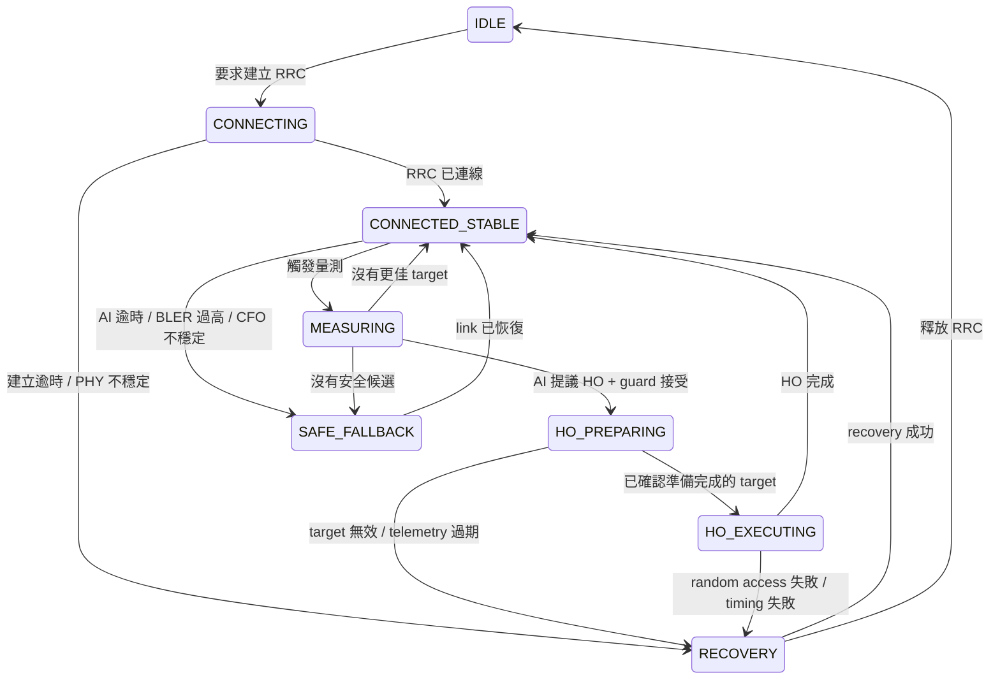

# 6G LEO / NTN 的 Neuro-Symbolic RRM 與 Handover Supervisor

## 狀態與範圍（Status and Scope）

- Lifecycle：`RESEARCH_PARKING / CONCEPT_PROTOTYPE`（研究停放／概念原型）
- 實作狀態：`NOT_INTEGRATED`（尚未整合）
- 專案邊界：不屬於目前 Lab01 / Lab02 已驗證主線
- Runtime 邊界：尚未實作或驗證真實 LEO / NTN 整合

目前可成立的主張僅限於：已定義一套 Neuro-Symbolic RRM / Handover Supervisor 的
研究原型架構。此架構包含 AI 提案、符號式防護、動態信任仲裁、確定性回退策略與
PHY 感知約束，可作為未來 6G NTN / LEO handover 研究的候選起點。

本文件保存此架構，但不授權原始碼變更、排程器變更、協定控制、部署、實驗室主機存取或
Runtime 操作。

## 問題陳述（Problem Statement）

NTN 中的 LEO handover 不能只根據 SINR 選擇。某個候選目標可能看似訊號良好，卻只剩
很短的可見窗口、超出 Doppler 或 residual CFO 補償能力、具有過高的單向延遲，或只存在於
過期遙測資料中。HARQ BLER 與不穩定的 PHY 條件也可能使高信心分數的提案變得不安全。

AI Agent 不得繞過 MAC / RRC 或協定因果約束。其輸出只能是提案，且仍受符號式約束、
動態信任門檻、確定性回退策略與實體連線狀態約束。

## 第一原理約束（First-Principles Constraints）

- **AI can suggest.（AI 可以提出建議。）**
- **State machine can veto.（State machine 可以否決。）**
- **Arbitrator decides trust.（Arbitrator 決定信任門檻。）**
- **PHY reality has final authority.（實際物理狀態擁有最終權威。）**
- **confidence cannot override physics.（confidence 不得凌駕物理限制。）**

因此，信心分數是必要條件，但永遠不是充分條件。只有在遙測資料仍有效、動作符合目前協定
狀態、候選目標可被觀測，且所有已設定的 PHY 感知防護條件均通過時，提案才具備被接受的資格。

## 系統 Pipeline（System Pipeline）

Canonical pipeline（標準流程）如下：

```text
PHY/MAC Telemetry
  -> Observation Builder
  -> AI Agent
  -> AIProposal
  -> SymbolicGuard
  -> DynamicArbitrator lambda(t)
  -> RRMAction
  -> Protocol Adapter
  -> MAC / RRC / Scheduler / Mobility Execution
```

最後的執行階段是架構邊界，不代表已完成整合。本文件中的任何元件都不會呼叫真實 MAC、RRC、
排程器或移動性介面。

## 三層 Neuro-Symbolic 架構

| 層級 | 角色 | 強制邊界 |
| --- | --- | --- |
| `AIProposal` | 提出候選動作，並表達信心分數與不確定性。 | 僅能提出提案；不得直接呼叫 MAC / RRC。 |
| `SymbolicGuard` | 套用 RRC 因果約束、handover 階段因果約束、遙測資料時效性、候選目標有效性與 PHY 感知規則。 | 任一違規都會否決提案。 |
| `DynamicArbitrator` | 計算 `lambda(t)`，並判斷通過防護檢查的提案是否具備足夠信任度。 | 被拒絕的提案會轉入確定性回退策略。 |

被接受的結果會成為候選 `RRMAction`；未來的 `Protocol Adapter` 仍必須維持狀態機與各實作
特有的安全檢查。

## AIProposal

`AIProposal` 是僅用於提出提案的資料結構。候選職責如下：

- 提議 handover；
- 提議目標衛星、波束或 cell；
- 提議 RB 分配；
- 提議 MCS；
- 提議安全回退策略；
- 提議冗餘傳輸。

它不得直接呼叫 MAC / RRC。代表性欄位如下：

| 欄位 | 概念意義 |
| --- | --- |
| `action` | 提議的 RRM 或移動性動作。 |
| `target_link_id` | 候選衛星、波束或 cell 的識別碼。 |
| `rb_fraction` | 提議的資源區塊分配比例。 |
| `mcs` | 提議的調變與編碼方案。 |
| `confidence` | 只能在符號式檢查後使用的模型信心分數。 |
| `uncertainty` | 提供給仲裁使用的提案不確定性。 |
| `expected_reward` | 模型預估結果，不是實測證據。 |
| `policy_version` | 候選提案策略的版本識別碼。 |

## SymbolicGuard

`SymbolicGuard` 會在信任仲裁前評估強制約束，職責如下：

- 強制執行 RRC 因果約束與 handover 階段因果約束；
- 拒絕過期遙測資料；
- 確認候選目標存在於目前測量集合；
- 依補償能力驗證 residual CFO 與 Doppler；
- 驗證單向延遲與預期停留時間；
- 驗證 SINR / RSRP 與連線負載；
- 納入 HARQ BLER 與其他 PHY 不穩定指標；
- 當 PHY 不穩定時拒絕激進動作。

較高的 AI 信心分數無法抵銷符號式違規。

## DynamicArbitrator 與 lambda(t)

`DynamicArbitrator` 會計算 `lambda(t)`，也就是動態 AI 信任門檻。
下列情況會提高門檻：

- Doppler 風險上升；
- residual CFO 上升；
- 單向延遲上升；
- HARQ BLER 上升；
- AI 不確定性上升；
- 符號式違規數量上升。

作為未來的策略候選方案，當 AI 提案反覆被接受，且被接受的提案產生穩定結果時，門檻可以
下降。這是設計假設，不是已驗證的調適結果。

決策規則必須嚴格執行：只有在沒有符號式違規，且 AI 信心分數大於或等於 `lambda(t)` 時，
才能接受 AI 提案；否則必須選擇確定性基準回退策略。

### 概念性仲裁虛擬碼（Arbitration Pseudocode）

以下內容僅為虛擬碼（pseudocode），不是可執行的 Runtime 整合，也不會呼叫真實協定或
排程器介面。

```text
record AIProposal:
    action
    target_link_id
    rb_fraction
    mcs
    confidence
    uncertainty
    expected_reward
    policy_version

record ArbitrationDecision:
    accepted_ai_proposal
    selected_action
    reason
    trust_threshold

function arbitrate(observation, proposal, history):
    violations = SymbolicGuard.evaluate(observation, proposal)
    trust_threshold = DynamicArbitrator.lambda(t, observation, proposal, history)

    if violations.is_empty() and proposal.confidence >= trust_threshold:
        return ArbitrationDecision(
            accepted_ai_proposal = true,
            selected_action = proposal.action,
            reason = "AI_PROPOSAL_ACCEPTED",
            trust_threshold = trust_threshold
        )

    fallback = deterministic_baseline_fallback(observation)

    if not protocol_state_allows(observation.ue_state, fallback):
        fallback = NOOP

    return ArbitrationDecision(
        accepted_ai_proposal = false,
        selected_action = fallback,
        reason = violations or "AI_CONFIDENCE_BELOW_LAMBDA",
        trust_threshold = trust_threshold
    )
```

## 協定因果約束與狀態機（Protocol Causality and State Machine）

RRC 因果約束與 handover 階段因果約束都是強制邊界。代表性規則如下：

- `IDLE` 不能執行 `ALLOCATE_RB`；使用者平面 RB 分配必須符合 `RRC_CONNECTED` 語意。
- `HO_EXECUTE` 不能跳過 `HO_PREPARE`。
- 不得選擇測量集合中不存在的候選目標。
- 過期遙測資料不得驅動 handover。

候選狀態模型如下：



## PHY 感知防護條件

本文件不主張任何數值門檻。未來實驗必須先依已聲明的模型或實測能力定義門檻，才能進行評估。

| 觀測項目 | 防護問題 | 候選安全回應 |
| --- | --- | --- |
| 遙測資料時效 | 觀測資料是否足夠新，能支援動作的時間範圍？ | 拒絕過期輸入。 |
| 目標是否在集合內 | `target_link_id` 是否存在於目前測量集合？ | 拒絕未知目標。 |
| Doppler | 目標 Doppler 是否在已聲明的補償能力內？ | 拒絕或使用安全回退策略。 |
| Residual CFO | residual CFO 是否穩定且在已聲明的限制內？ | 提高 `lambda(t)` 或拒絕。 |
| 單向延遲 | 協定時序是否能容許實測或模型估算的延遲？ | 拒絕違反時序約束的動作。 |
| 停留時間 | 有效可見時間是否長於準備與執行所需時間？ | 拒絕停留時間過短的目標。 |
| SINR / RSRP | 通過其他約束後，連線品質是否足夠？ | 只視為一項輸入，絕不作為唯一判斷依據。 |
| 連線負載 | 目標是否能接受提議的分配？ | 降低分配比例或拒絕。 |
| HARQ BLER | 可靠度是否足夠穩定，能支援提議的動作？ | 提高 `lambda(t)` 或選擇回退策略。 |

## 邊界情境（Edge Cases）

### `HO_PREPARING` 期間 AI 失效

- 記錄 `AI_TIMEOUT`。
- 選擇確定性基準回退策略。
- 若 UE 狀態無法合法支援使用者平面動作，則選擇 `NOOP`。

### 高 SINR 但可見時間很短

若候選目標的 SINR 很高，但停留時間約為 `0.5 s`，則拒絕 handover，並記錄
`TARGET_DWELL_TIME_TOO_SHORT`。

### `IDLE` 狀態下分配 RB

拒絕此提案；不得在 `RRC_CONNECTED` 以外分配使用者平面 RB。

### 信心分數與 Doppler

即使 AI 信心分數很高，只要候選目標的 Doppler 超出補償能力，仍必須拒絕提案，並記錄
`TARGET_DOPPLER_EXCEEDS_COMPENSATION_RANGE`。

## 實作 Roadmap（Implementation Roadmap）

此規劃路線定義研究關卡，不代表已排程實作。每個 Phase 都需要另行建立範圍明確的任務、
證據計畫與 Human Review 決策。

## Phase A — Pure Simulator（純模擬器）

候選元素：

- 簡化的 LEO 軌道或衛星過境軌跡；
- UE 移動軌跡；
- RSRP / SINR 產生器；
- Doppler 產生器；
- 延遲產生器；
- `AIProposal` 產生器；
- `SymbolicGuard`；
- `DynamicArbitrator`；
- handover 結果記錄器。

候選指標：

- `handover_success_rate`；
- `ping_pong_count`；
- `outage_time_ms`；
- `AI_accept_ratio`；
- `guard_reject_reason_distribution`；
- `lambda(t) time series`。

## Phase B — 5G SDR Observability Integration（可觀測性整合）

候選觀測來源；存取與證據必須另行 Review：

- srsRAN / srsLTE 日誌；
- pcap 與 Wireshark 觀測資料；
- PHY 指標；
- MAC 指標；
- RRC 事件；
- ZeroMQ 延遲／封包時序。

候選映射目標：

- `PhyObservation`；
- `LinkCandidate`；
- `UEContext`。

此 Phase 只進行觀測資料映射，不代表控制整合。

## Phase C — RRM / Handover Adapters

候選 adapter 邊界：

- `PhyTelemetryAdapter`；
- `MeasurementReportAdapter`；
- `MACSchedulerAdapter`；
- `RRCMobilityAdapter`。

上述名稱只描述可能的介面，不代表 adapter、排程器擴充點或移動性控制路徑已存在。

## 與目前 5G SDR 專案的關係（Relation to Current 5G SDR Project）

目前 5G SDR 專案可提供關於遙測資料時效性、ZeroMQ 時序、PHY 與 MAC 量測、RRC 事件與
證據品質的未來研究問題。本文件不宣稱目前 Lab01 / Lab02 產出物已填入 `PhyObservation`、
`LinkCandidate` 或 `UEContext`，也不修改或驗證任何目前 Runtime 路徑。

## 目前限制與禁止宣稱（Current Limitations and Forbidden Claims）

不得以此架構作為下列事項的證據：

- 已符合 3GPP NTN 規範；
- 已實作真實 LEO handover；
- 已存在 srsRAN 排程器整合；
- 已實作 MAC / RRC 移動性控制；
- 已驗證真實 Doppler 補償。

此架構也不是與其他 RAN 控制架構之間已被接受的橋接方案。任何此類橋接都需要另行完成
研究議題受理與決策。

## 未來問題（Future Questions）

- 需要何種模擬器擬真度，才能評估停留時間與 Doppler 防護條件，且不誇大現實環境有效性？
- 遙測資料時效與單向延遲應如何影響 `lambda(t)`？
- 哪一種確定性基準策略能為 Phase A 提供公平比較？
- 在允許 `lambda(t)` 下降前，應如何定義已接受提案的穩定結果？
- 從觀測資料映射進入 adapter 設計前，需要哪些證據？
